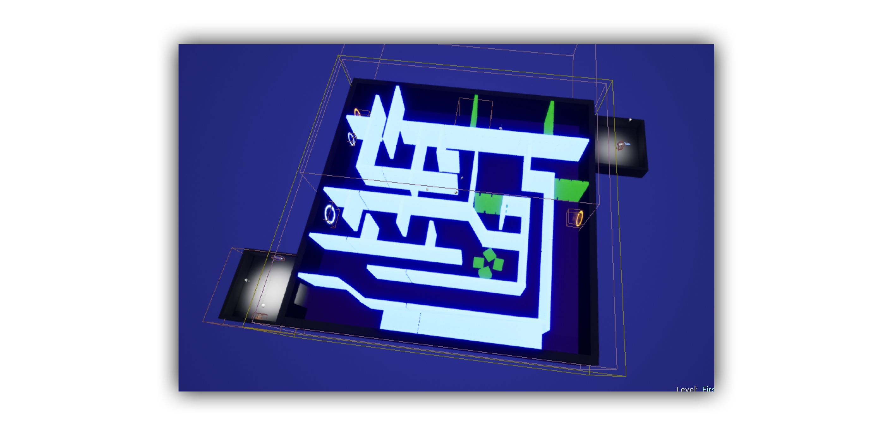

# Escape The Maze

"Escape The Maze" is a VR-Game for HTC Vive developed with Unreal Engine 4. It was a university project during the lecture "Visual Computing" in Spring 2018. The idea of the game, designing and developing the game was a team performance of four students.

### Game idea

The game is designed as first person shooter. The aim of the game is to go through the maze as fast as possible. Beside the normal walls the maze has sliding walls and other obstacles the player has to destroy on his way through the maze.

### Challenge and highlight of the game

The highlight of the game are the portals. The player can go through the portal and gets out at a different location in the maze. A challenge during creation of the portals was the teleporting of the projectiles.

Further documentation in german can be found in the file "EsacpeTheMaze_Ausarbeitung.pdf"